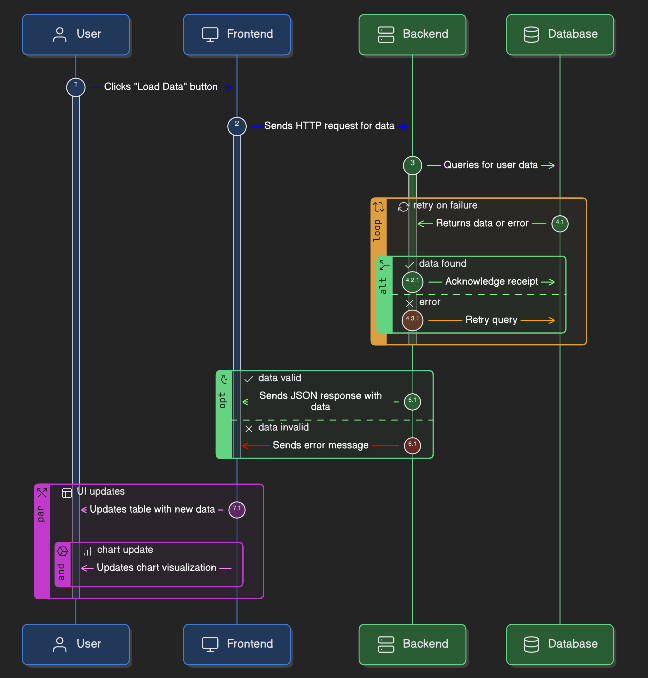
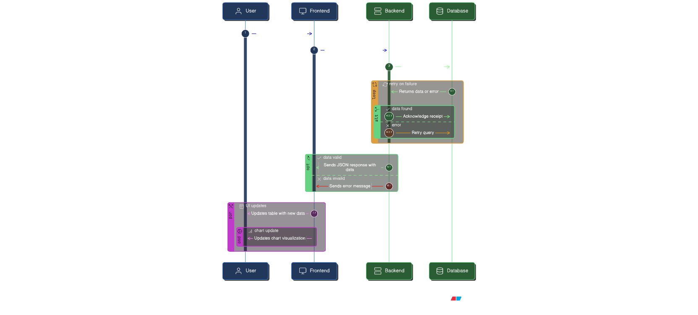

# FinTrack Project Analysis & Workflow

## 1. Project Overview
**FinTrack** is a modern, minimalist personal finance tracker designed for simplicity and speed. It features a dark-mode interface, real-time analytics, and seamless expense splitting capabilities. The application is built using a lightweight tech stack (Flask + Vanilla JS) and leverages Supabase for backend storage.

## 2. Key Features

### Current Version Capabilities:
- **📊 Interactive Dashboard**: Displays real-time summaries for Total Income, Total Expenses, and Current Balance.
- **🥧 Visual Analytics**:
  - **Pie Chart**: Breaks down expenses by category.
  - **Bar Chart**: Compares Income vs. Expenses.
- **💸 Transaction Management**:
  - **Add Transactions**: Quick input for amount, category, and optional notes.
  - **History List**: Scrollable list of recent transactions with color-coded tags.
- **✂️ Split Expense Feature**: (Unique) Allows users to instantly calculate their share of a bill among multiple people and log only their portion.
- **🌙 Dark Mode UI**: A premium, eye-friendly interface designed for extended usage.
- **🏷️ Categorization**: 17 built-in categories (13 Expense, 4 Income) with distinct color coding.

### 🚀 Market Differentiation
Unlike many generic expense trackers, FinTrack focuses on:
1.  **Zero-Friction Entry**: No complex setup or mandatory login (in the current basic version), allowing immediate usage.
2.  **Integrated Splitting**: The "Split" button is built directly into the expense form, solving the common pain point of group payments (e.g., dinner bills) without needing a separate app like Splitwise for simple calculations.
3.  **Visual-First Approach**: Charts are front-and-center, providing instant financial health checks rather than hiding them in reports tabs.
4.  **Lightweight & Fast**: Being a Single Page Application (SPA) served by Flask, it loads instantly and updates without page refreshes.

---

## 3. API Endpoints
The application uses a RESTful API provided by the Flask backend (`app.py`), which acts as a secure proxy to the Supabase database.

| Method | Endpoint | Description | Request Body / Parameters |
| :--- | :--- | :--- | :--- |
| `GET` | `/` | Serves the main application (`index.html`). | None |
| `GET` | `/transactions` | Fetches all transaction history. | None |
| `POST` | `/transactions` | Adds a new transaction. | `{ "amount": 100, "category": "Food", "note": "Lunch" }` |

---

## 4. File Structure & Responsibilities

### Backend
- **`app.py`**: The core application server.
    -   Initializes the Flask app.
    -   Configures CORS.
    -   Loads environment variables (`.env`).
    -   Defines routes (`/`, `/transactions`).
    -   Handles communication with Supabase using `requests`.

### Frontend
- **`index.html`**: The complete frontend application (SPA).
    -   **HTML**: Structure for Dashboard cards, Charts, Forms, and Transaction List.
    -   **CSS**: Custom styling for the dark theme, responsive layout, animations, and form elements.
    -   **JavaScript**:
        -   `fetchTransactions()`: Calls the backend API.
        -   `renderCharts()`: Uses Chart.js to visualize data.
        -   `calculate()`: Computes totals and updates DOM elements.
        -   `addSplitTransaction()`: Logic for splitting bills.

### Configuration
- **`requirements.txt`**: Lists Python dependencies (`flask`, `flask-cors`, `requests`, `python-dotenv`).
- **`vercel.json`**: deployment configuration for Vercel, treating the Python app as a serverless function.
- **`.env`**: Stores sensitive credentials (`SUPABASE_URL`, `SUPABASE_KEY`).

---

## 5. Detailed Workflow Charts

### A. Overall System Architecture

### B. "Add Transaction" Workflow

### C. "Split Expense" Feature Logic

